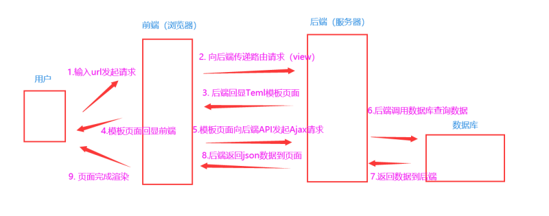
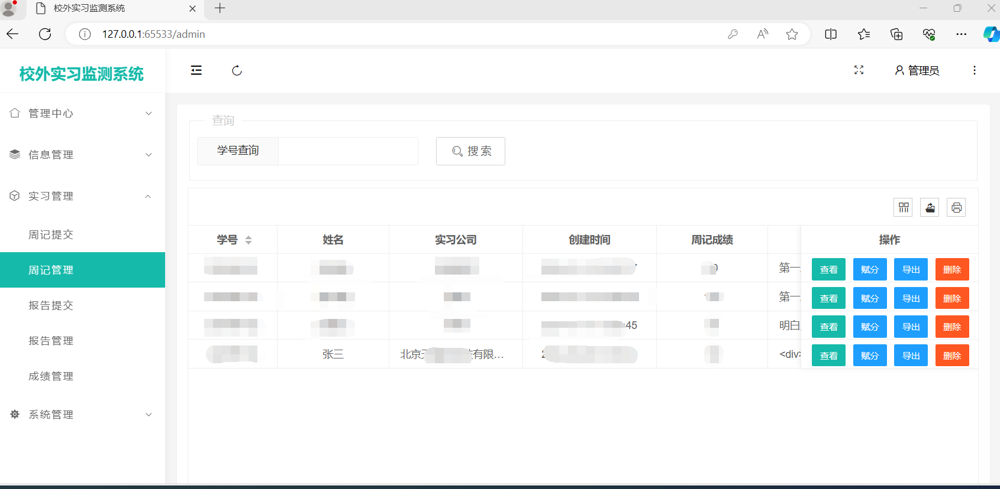

> 坚持不懈，梦想必成！

### 项目名称

-----------------------

大学生校外实习监测系统的设计及实现，Student internship monitoring system，即StuMon。

采用的是 `前端 LayUI框架` +  `后端 Flask框架` + ` 数据库 SQLlite`  +  `服务器 Linux` （阿里云ECS服务器）

采用`前后端分离技术`实现：

- 前端 采用LayUI 框架 编写页面，向后端传递 AJax请求，解析Ajax请求的数据 回显数据到页面

- 后端 采用 Flask框架 编写路由、APi接口，接收前端请求，操作数据库，返回json数据到前端

**MVT开发模式**

**M–model(模型)** ：即 操作数据库

**V–views(视图)**： 即 控制路由和API接口

**T–template(模板)**：即 控制返回的页面模板

### 功能实现

---------------

**登录**

实现登录功能

**个人中心**

​	个人信息（数据可视化显示信息，包括 学生信息  + 周记成绩 + 周报成绩 + 总成绩 +修改密码功能 ）

**信息管理（管理端）**

​	学生信息（学生信息增删改查）

​	实习信息（实习信息增删改查）

**实习管理**

​	实习周记

​		周记提交（form表单提交页面）

​		周记管理（增删改查 + 赋分 ）

​	实习报告

​		报告提交（提交页面）

​		报告管理（增删改查 + 赋分 ）

​	实习成绩（根据赋值的 实习报告分数40% + 实习周记30% + 30% 赋分 编写表格）

**系统管理  **  

​	角色管理（角色的增删改查 及分类  管理员 + 老师 + 学生） 

​	用户管理（用户的增删改查 及赋予何种角色）

​	权限管理 （角色可以操作哪些功能）

**学生信息页面：**

搜索框 +  表格渲染学生信息

表包含（学号，姓名，性别，年龄，专业，联系电话，电子邮箱，家庭住址）

实现操作：查询学生信息、增加学生信息、编辑学生信息、删除学生信息

**实习信息页面：**

搜索框 +  表格渲染实习信息

表包含（实习编号、**学生学号**、实习公司、实习岗位、实习时间）

实现操作：查询实习信息、增加实习信息、编辑实习信息、删除实习信息

针对实习安排数据表，设置学号的外键关联，这样做，当我添加一条数据进入实习信息表中，必须确保该学号在学生信息表中存在，否则无法添加到实习信息表中。

如果尝试插入一个不存在于学生信息表中的学号，数据库系统将抛出外键约束错误，因为外键的目的是确保只有有效的引用可以插入关联表。

**实习周记**

周记提交页面

​	form表单提交数据到数据库

**周记管理页面**

表格渲染数据，查询并赋分给相应周记。

表包含：学号、姓名、实习公司、提交时间、实习周记、周记成绩

操作：查询、删除、赋分

导出成word文档

赋分的时候自动将**学号**、姓名、周记成绩发送到实习成绩表中

**报告管理页面**

表格渲染数据，查询并赋分给相应报告

表包含：学号、姓名、实习公司、提交时间、实习报告、报告成绩

操作：查询、删除、赋分

导出成word文档

赋分的时候自动将**学号**、姓名、报告成绩发送到实习成绩表中

### 截图

